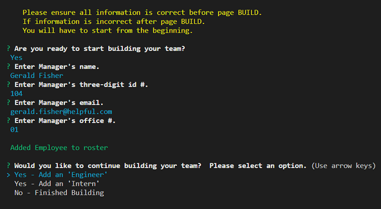
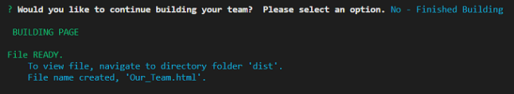
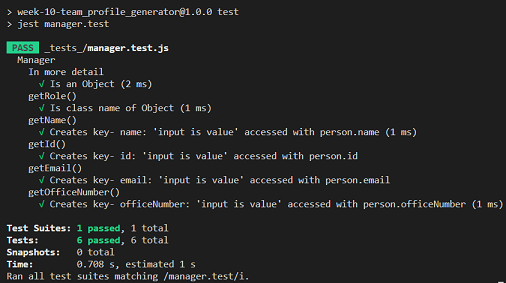

[](https://www.javascript.com)<br>
# **Team Profile Generator**

### Welcome!&nbsp;&nbsp;Looking for a way to auto generate an *Our Team Page* with just simple input?&nbsp;&nbsp;Here it is.&nbsp;&nbsp;This dynamic application will auto process an HTML file based on input provided.&nbsp;&nbsp;Soon you'll have a page to introduce *each member* of your team.<br><br>


### **Table of contents:**

- [Getting Started](#getting)
- [Installations](#installations)
- [Usage](#usage)
- [Questions](#questions)
- [Resources](#resources)
- [Location](#location)
- [License](#license)

## Getting Started:

<br>First to get started you will need to have downloaded Node.js.&nbsp;&nbsp;If you have not, you may go here.&nbsp;&nbsp;[*Node.js downloads*](https://nodejs.org/en/download/)

## Installations:
  
<br>inquirer&nbsp;&nbsp;[*for more information*](https://www.npmjs.com/package/inquirer)

**AND**

<br>jest&nbsp;&nbsp;[*for more information*](https://jestjs.io/)
  
*For example 1:*&nbsp;&nbsp;First, travel to the directory folder containing the index.js file and open in VSCode.&nbsp;&nbsp;Second, right click on the index.js file, select 'Open in Integrated Terminal'.&nbsp;&nbsp;Third, once the terminal opens, on the command line type the first provided code example *below*.&nbsp;&nbsp;This will allow the package.json file to automatically generate.<br><br>*For example 2:*&nbsp;&nbsp;Now to install inquirer.&nbsp;&nbsp;On the command line type the second provided code example *below*.&nbsp;&nbsp;You will have noticed a folder name node_modules has appeared.&nbsp;&nbsp;These are the packets needed to run *inquirer*.<br><br>*For example 3:*&nbsp;&nbsp;Now to install jest.&nbsp;&nbsp;On the command line type the third provided example *below*.&nbsp;&nbsp;These are the packets needed to run *jest*.

*Example 1:*
```shell
npm init -y
```

*Example 2:*
```shell
npm i inquirer@8.2.4
```

*Example 3:*
```shell
npm i jest@29.3.1
```

## Usage:
  
Once the above installations are complete, to initalize the application, on the command line type the *example* provided below.&nbsp;&nbsp;In the beginning you'll see a log to the console providing helpful information.&nbsp;&nbsp;Then you will see prompts that will guide you to begin generating an *Our Team Page*.

*Example:*
```shell
node index.js
```

***app image examples***





-Video and Screenshots *coming soon*.

## Tests:


There are four tests to run on Class Objects.

**1. Class Employee:**
-   On the command line, type the example below.
```shell
npm run test employee.test
```

**2. Class Manager extends Employee:**
-   On the command line, type the example below.
```shell
npm run test manager.test
```

**3. Class Engineer extends Employee:**
-   On the command line, type the example below.
```shell
npm run test engineer.test
```

**4. Class Intern extends Employee:**
-   On the command line, type the example below.
```shell
npm run test intern.test
```

*If console error returns no tests specified.  Check 'package.json' file.  Under "scripts": "test": replace "echo---" with "jest".*

***test image example***



## Questions:

For any questions or additional feedback.

**_-Contact Information:_**

Email:&nbsp;&nbsp;[mag33@gmail.com](mag33@gmail.com)
## Resources:

[node.js](https://nodejs.org/en/docs/)<br>[inquirer](https://www.npmjs.com/package/inquirer?activeTab=readme)<br>[jest](https://jestjs.io/)<br>[Font Awesome](https://fontawesome.com/)<br>[wikipedia](https://en.wikipedia.org/wiki/List_of_colloquial_names_for_universities_and_colleges_in_the_United_States)<br>[Google](https://www.google.com)

## Location:

[Team Profile Generator](https://github.com/zMag33z/week-10-Team_Profile_Generator)

## License:
  

  
See *Terms & Conditions* of the license [***here***](https://opensource.org/licenses/MIT).

<br>


#### [**Back to top**](#)